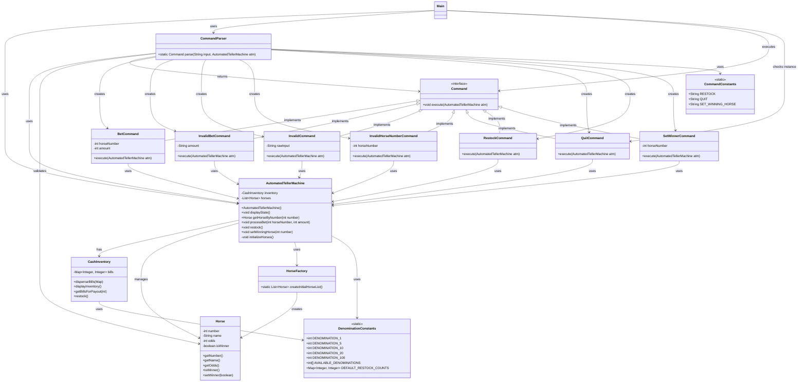

# Horse Track ATM (Automated Teller Machine) Simulation

## Technologies Selected

- OpenJDK 17
- Gradle

## Class Diagram

```mermaid
classDiagram
    %% Classes under com.vikingcloud.horsetrack.command

    class Command {
        <<interface>>
        +void execute(AutomatedTellerMachine atm)
    }

    class BetCommand {
        +execute(AutomatedTellerMachine atm)
        -int horseNumber
        -int amount
    }

    class InvalidBetCommand {
        +execute(AutomatedTellerMachine atm)
        -String amount
    }

    class InvalidCommand {
        +execute(AutomatedTellerMachine atm)
        -String rawInput
    }

    class InvalidHorseNumberCommand {
        +execute(AutomatedTellerMachine atm)
        -int horseNumber
    }

    class QuitCommand {
        +execute(AutomatedTellerMachine atm)
    }

    class RestockCommand {
        +execute(AutomatedTellerMachine atm)
    }

    class SetWinnerCommand {
        +execute(AutomatedTellerMachine atm)
        -int horseNumber
    }
    
    %% Classes under com.vikingcloud.horsetrack.constants
    
    class CommandConstants {
        <<static>>
        +String RESTOCK
        +String QUIT
        +String SET_WINNING_HORSE
    }
    
    class DenominationConstants {
        <<static>>
        +int DENOMINATION_1
        +int DENOMINATION_5
        +int DENOMINATION_10
        +int DENOMINATION_20
        +int DENOMINATION_100
        +int[] AVAILABLE_DENOMINATIONS
        +Map~Integer, Integer~ DEFAULT_RESTOCK_COUNTS
    }
    
    %% Classes under com.vikingcloud.horsetrack.model

    class Horse {
        -int number
        -String name
        -int odds
        -boolean isWinner
        +getNumber()
        +getName()
        +getOdds()
        +isWinner()
        +setWinner(boolean)
    }

    class CashInventory {
        -Map~Integer, Integer~ bills
        +dispenseBills(Map)
        +displayInventory()
        +getBillsForPayout(int)
        +restock()
    }
    
    %% Classes under com.vikingcloud.horsetrack.parser

    class CommandParser {
        +static Command parse(String input, AutomatedTellerMachine atm)
    }
    
    %% Classes under com.vikingcloud.horsetrack.service

    class HorseFactory {
        +static List~Horse~ createInitialHorseList()
    }
    
    %% Classes under com.vikingcloud.horsetrack

    class AutomatedTellerMachine {
        -CashInventory inventory
        -List~Horse~ horses
        +AutomatedTellerMachine()
        +void displayState()
        +Horse getHorseByNumber(int number)
        +void processBet(int horseNumber, int amount)
        +void restock()
        +void setWinningHorse(int number)
        -void initializeHorses()
    }

    class Main
    
    %% Dependencies between classes and interfaces
    
    Command <|-- BetCommand : implements
    Command <|-- InvalidBetCommand : implements
    Command <|-- InvalidCommand : implements
    Command <|-- InvalidHorseNumberCommand : implements
    Command <|-- QuitCommand : implements
    Command <|-- RestockCommand : implements
    Command <|-- SetWinnerCommand : implements
    
    BetCommand --> AutomatedTellerMachine : uses
    InvalidBetCommand --> AutomatedTellerMachine : uses
    InvalidCommand --> AutomatedTellerMachine : uses
    InvalidHorseNumberCommand --> AutomatedTellerMachine : uses
    QuitCommand --> AutomatedTellerMachine : uses
    RestockCommand --> AutomatedTellerMachine : uses
    SetWinnerCommand --> AutomatedTellerMachine : uses
    
    CashInventory --> DenominationConstants : uses
    
    CommandParser --> AutomatedTellerMachine : uses
    CommandParser --> Horse : validates
    CommandParser --> Command : returns
    
    %% CommandParser uses these specific commands
    CommandParser --> BetCommand : creates
    CommandParser --> InvalidBetCommand : creates
    CommandParser --> InvalidCommand : creates
    CommandParser --> InvalidHorseNumberCommand : creates
    CommandParser --> QuitCommand : creates
    CommandParser --> RestockCommand : creates
    CommandParser --> SetWinnerCommand : creates
    
    CommandParser --> CommandConstants : uses
    
    HorseFactory --> Horse : creates
    
    AutomatedTellerMachine --> CashInventory : has
    AutomatedTellerMachine --> Horse : manages
    AutomatedTellerMachine --> HorseFactory : uses
    AutomatedTellerMachine --> DenominationConstants : uses
    
    Main --> AutomatedTellerMachine : uses
    Main --> CommandParser : uses
    Main --> Command : executes
    Main --> QuitCommand : checks instance
```
